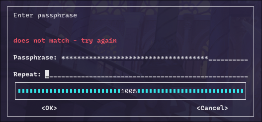
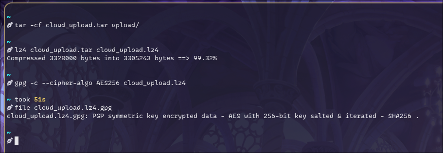
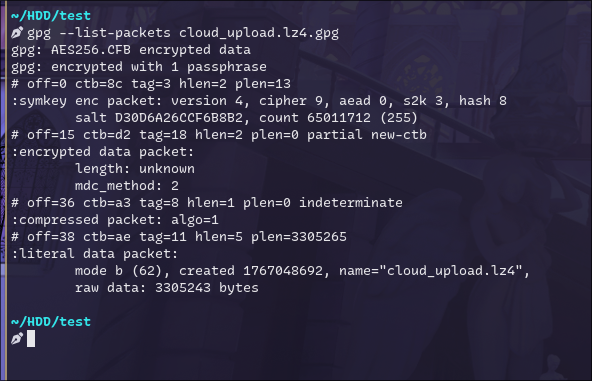
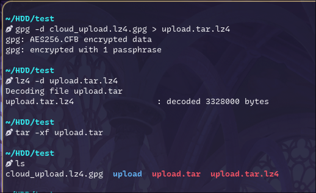
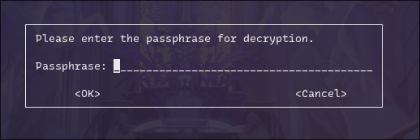

Cloud storage is comfortable. This comfort came with trade-off -> your data is on someone else machine.

My post covers personal "how to encrypt files/directories on linux" snippet,  it demonstrates my security hygiene.

## How this protects you?
Encrypting before upload primarily reduces impact from:
- cloud account compromise (attacker can copy files, but cannot read plaintext without the passphrase)
- accidental public sharing / exposed links or buckets
- provider-side access within the limits of the provider’s controls
- secondary leaks (backups, logs, or third-party handling of stored blobs, including insider misuse risk - low probability, high impact)

It does **not** protect against:
- malware or an attacker already on your machine before encryption
- weak or reused passphrases
- metadata you still reveal (the outer filename, timestamps, approximate size), unless you take extra steps

---

Assume the folder you want to upload is named `upload/`.
## Linux
**Tools**:
- `tar` for archiving
- `lz4` for fast compression
- `gpg` (GnuPG) for encryption

### 1) Archive the folder
This keeps the folder structure in one file:

```bash
tar -cf cloud_upload.tar upload/
```

### 2) Compress (lz4)
Compression can reduce upload size and makes later encryption faster (less data):

```bash
lz4 cloud_upload.tar cloud_upload.tar.lz4
```

### 3) Encrypt (GPG symmetric, AES-256)
Symmetric encryption is the simplest “one file, one passphrase” approach:

```bash
gpg -c --cipher-algo AES256 cloud_upload.tar.lz4
```

You’ll be asked to enter the passphrase twice. If you mistype, GPG will reject it:



Encryption run example:



Result: `cloud_upload.tar.lz4.gpg` (this is what you upload to cloud). 
Before uploading, generate and save a checksum. This gives you a fixed reference so you can later prove the file was not corrupted or modified during transfer or storage.

### 4) (Recommended) Record a checksum
Checksums are cheap integrity insurance, especially after downloads:

```bash
sha256sum cloud_upload.tar.lz4.gpg > cloud_upload.tar.lz4.gpg.sha256
```

Upload both the `.gpg` file and the `.sha256` file.

### Verify what you created
A quick sanity check is to inspect the packet headers (this does not decrypt the content):

```bash
gpg --list-packets cloud_upload.tar.lz4.gpg
```

You should see the cipher listed (e.g., `AES256`) and “encrypted with 1 passphrase”:



you can also type:

```bash
file cloud_upload.tar.lz4.gpg
```

### Decryption
After downloading your encrypted asset, verify the checksum first:

```bash
sha256sum -c cloud_upload.tar.lz4.gpg.sha256
```

Then decrypt, decompress, and extract:

```bash
gpg --decrypt cloud_upload.tar.lz4.gpg > upload.tar.lz4
lz4 -d upload.tar.lz4
tar -xf upload.tar
```

Example run:



### About “no passphrase prompt” during decryption
If you decrypted once, GnuPG may **cache** your passphrase via `gpg-agent`. That can make subsequent decryptions succeed without showing a prompt—nothing is “wrong”; it’s expected behavior.

If you want to confirm the prompt really appears (e.g., before documenting your process), kill the agent and retry:

```bash
gpgconf --kill gpg-agent
gpg --decrypt cloud_upload.tar.lz4.gpg > /dev/null
```

You should now see a pinentry prompt:



---
### Practical hygiene
- Use a strong, unique passphrase (password manager is fine).
- Keep the plaintext `upload/` directory local-only; upload only the `.gpg` artifact.
- Consider naming conventions that don’t leak sensitive details (encrypted files can still expose filenames unless you choose to avoid them).

---
## Why you should archive first, then compress and finally encrypt?

1. Archiving first turns “a folder” into one deterministic object. <br>
    Cloud upload tools and encryption tools generally operate on files, not directory trees. 
    `tar` also keeps the structure together (paths, timestamps, basic permissions), so you restore the folder exactly, not as a loose pile of files that you have to reassemble. 
<br>
2. Compressing second works because compression needs to see patterns in plaintext. <br>
     Once you encrypt, the output is intentionally random-looking, so compression won’t help (and often makes the file slightly bigger due to compression headers). So if you want smaller uploads and faster transfers, you compress before encryption. 
<br>

3. Encrypting last keeps everything protected in one step.<br>You end up with a single ciphertext file that you can upload, copy, checksum, and manage. It also avoids leaking information through intermediate artifacts in the cloud: if you encrypted individual files without archiving, you’d expose the full directory listing (filenames and counts) and make restores slower and error-prone.

### What happens if you change the order?

- Encrypt then compress: compression becomes useless (encrypted data won’t compress).
- Compress then archive: not really meaningful for folders; you’d still need an archive container to keep structure.
- Encrypt each file separately: works, but you keep more metadata visible (filenames, folder tree), you manage many encrypted files, and restore becomes more tedious.

So the chosen order is mostly about two principles: “make it one object” (archive), “reduce size while it’s still compressible” (compress), and “protect the final artifact” (encrypt).

