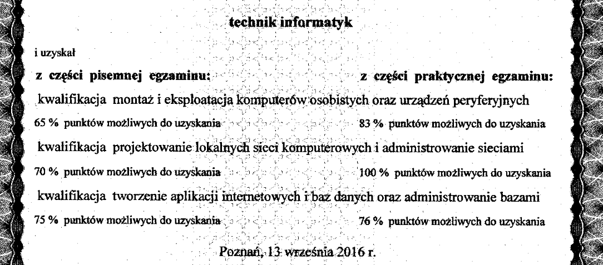
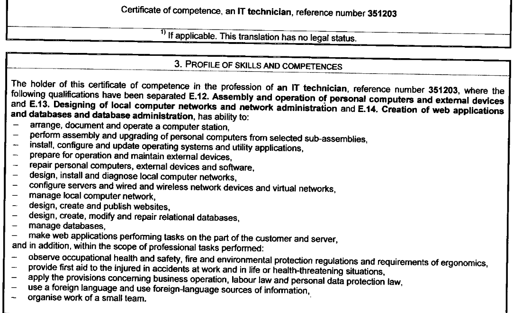

## Skan dyplomu - Technik informatyk

## Europass

Europass certificate supplement (EN, scan) orignal earned in 2016. Some skills i didn't listed, like databases (i didn't used much SQL since school to be honest).

- Arrange, document, and operate a computer workstation
- Assemble and upgrade personal computers from selected sub-assemblies
- Install, configure, and update operating systems and utility applications
- Prepare external devices for operation and maintain them
- Repair personal computers, external devices, and software
- Design, install, and diagnose local computer networks
- Configure servers, wired and wireless network devices, and virtual networks
- Manage a local computer network
- Design, create, and publish websites
- Develop web applications that perform tasks on the customer and server side
- Follow occupational health and safety, fire protection, environmental protection, and ergonomics requirements
- Use a foreign language and foreign-language information sources

---

> [!info] Ostatnia aktualizacja: _26.02.2026_
